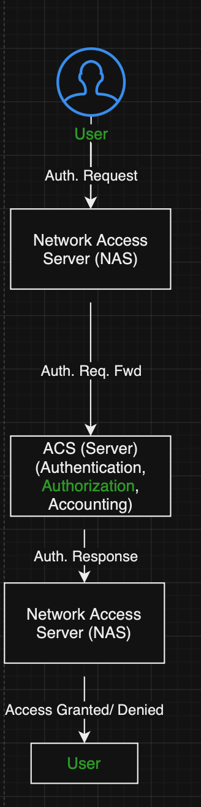

# RADIUS Authentication
## Computer Network - AAA (Authentication, Authorization and Accounting)

### Explain each of the three A’s as you would to a non-technical family member. Use an analogy or a story.
- <u> Authentication:</u> Imagine you have a secret club with a special handshake to get in. Authentication is like checking if someone knows that secret handshake before letting them into the club. In computer networks, it's confirming someone's identity before allowing them access to resources or services, like entering a secure website by using a username and password.

- <u> Authorization:</u>  Once someone is inside the club, they might have different levels of access or permissions. Authorization is like determining what parts of the club someone is allowed to enter or what they can do once they're inside. In networks, it's about deciding what a user can access or do after they've been authenticated, like limiting access to certain files or areas of a network.

- <u> Accounting:</u>  Imagine keeping track of who comes in and out of the club, what they do while they're there, and how long they stay. Accounting in networking is about recording and tracking the activities of users while they're on the network, like monitoring data usage, time spent online, or resources accessed. This helps in keeping records for billing, auditing, or security purposes.

### What should the administrator do if the ACS server fails to authenticate a user during AAA implementation?
- Check the local database for a backup option. 

### What is the role of the NAS in the AAA implementation using an ACS server? Use a diagram.
- Regarding the role of NAS (Network Access Server)

## RADIUS Concepts
### What are the benefits of using RADIUS for authentication and authorization?
- Centralized Authentication, enhanced security, scalability, flexibility in authentication methods, authorization and accounting. 

### What is RADIUS and what does it stand for?
- Remote Authentication Dial-In User Service. It is a networking protocol that provides centralized authentication, authorization, and accounting management for users who connect and use a network service. RADIUS allows a company to maintain user profiles in a central database that multiple remote servers can utilize to authenticate users.

### Research: What encryption algorithms does RADIUS use?
- RADIUS itself does not dictate a specific encryption algorithm, but it typically operates over various protocols that can use encryption for secure communication. The security of RADIUS communication can be ensured through encryption methods applied in the underlying transport protocols, such as:

- PAP (Password Authentication Protocol): Sends credentials in plaintext (unencrypted).
- CHAP (Challenge Handshake Authentication Protocol): Uses one-way hashing with MD5 (Message Digest 5) by default, though it is susceptible to precomputed dictionary attacks.
- EAP (Extensible Authentication Protocol): Can work with various encryption methods depending on the specific EAP method used, such as EAP-TLS (Transport Layer Security) using digital certificates for secure authentication.

#### Resources 
[ChatGPT] (https://chat.openai.com/share/68183fd0-dd8a-48a5-b247-57a75a491fe3)  
[Computer Network - AAA (Authentication, Authorization and Accounting)] (https://www.geeksforgeeks.org/computer-network-aaa-authentication-authorization-and-accounting/)  
[draw.io] (https://app.diagrams.net/)